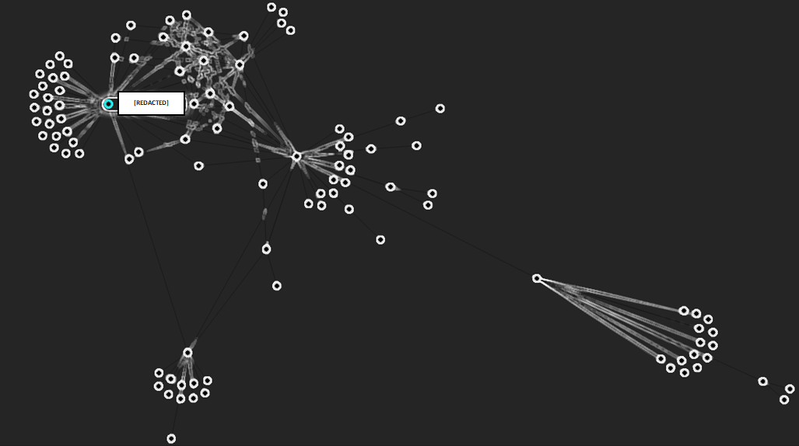

# **Introduction to OSINT Web Resources**

Yet another list of OSINT web resources.

> _"This is my list. There are many like it, but this one is mine. My list is my best friend. It is my life. I must master is as I mush master my life. Without me, my list is useless. Without my list, I am useless."_

​											*Who doesn't love pretty graphs?*

Oh look, its *yet another* list of OSINT resources..

Since I do mainly do OSINT work for a living, you can imagine that I have accumulated a huge amount of resources and tools to assist me in locating certain information about certain things over the years. Figured I should share them in a mostly organized fashion, because sharing is caring right?

The below lists are currently still a work in progress! It was going to take ages to write so I've decided to just publish what I already have and continue to push updates on the live versions. So stay tuned for more.

# **To Do**

- [ ] Add additional resources to all sections. (This one will never be completed).
- [x] ~~Create an organized .html bookmark file of all these resources and make it available for download. So readers can import it directly into their browsers.~~ - Full and organized .html bookmark file available [here](https://github.com/OhShINT/ohshint.gitbook.io/blob/main/Lists_of_OSINT_Web_Resources/Bookmarks/OHSHINT_Complete_Bookmarks_Organized_20-10-2021.html).
- [x] ~~Create a PDF document of this entire list and make it available for download.~~ - Available [here](https://github.com/OhShINT/ohshint.gitbook.io/blob/main/Lists_of_OSINT_Web_Resources/PDFs/ohshint_Complete_List_of_OSINT_Web_Resources.pdf).
- [x] ~~Create PDF copies of all individual resource subsections.~~ - All of these are now available [here](https://github.com/OhShINT/ohshint.gitbook.io/tree/main/Lists_of_OSINT_Web_Resources/PDFs).
- [x] ~~Create PDF copies of all articles.~~ - Now available [here](https://github.com/OhShINT/ohshint.gitbook.io/tree/main/OSINT_Articles/PDFs).
- [ ] Complete the *mostly* incomplete sections.
  - [ ] Complete the "Phone Numbers" section.
  - [ ] Complete the "People Investigations" section.
  - [ ] Complete the "Real Estate" section.

# **Recently Added Resources**

When new resources are added, they will be listed and dated here. All dates are listed in *DD/MM/YYYY* format.

- **Search Engines**
  - **Document and File Search**
    - _Added 29/10/2021._ - [Gdrive Search](https://www.gdrivesearch.com/)  
A simple and fast tool that allows you to search Google Drive for files.
  - **Newspaper and News Search**
    - _Added 29/10/2021._ - [NewspaperArchive](https://newspaperarchive.com/)  
Explore billions of newspaper articles from all over the world. Extremely useful tool. Requires a paid subscription.
- **Digital Network Intelligence [DNINT]**
  - **WHOIS**
    - _Added 29/10/2021._ - [GoFindWHOIS](https://gofindwhois.com/)  
  A great online tool for locating information about a website or IP address. Offers WHOIS lookups, DNS records, IP tools, and other website enumeration tools. Created by [@netbootcamp](https://twitter.com/netbootcamp), so be sure to follow them for updates.
  - **Other Tools**
    - _Added 29/10/2021._ - [Bowserling](https://www.browserling.com/)  
Allows you to view a website in a different browser online. For example, a Mac user can test a website to see how it acts in Internet Explorer, without having to install a VM.
 - **Social Media Intelligence [SOCMINT]**
   - **General Social Media Tools**
     - _Added 30/10/2021._ - [GoFindWho](https://gofindwho.com/)  
  This is one of the coolest collection of online OSINT tools I have seen. Find people for free by phone number, name, email address, and username on Facebook and in public records. Created by [@netbootcamp](https://twitter.com/netbootcamp), so be sure to follow them for updates.
   - **Reddit**
     - _Added 30/10/2021._ - [Reveddit](https://www.reveddit.com/about/)  
   A searchable archive of removed content on Reddit. Search by username, subreddit, link or domain.
     - _Added 30/10/2021._ - [Pushshift Reddit Search](http://redditsearch.io/)  
A comprehensive search engine and real-time analytics tracker for Reddit.
 - **Data Sets**
   - _Added 30/10/2021._ - [Face Recognition Datasets](https://www.face-rec.org/databases/)  
A large collection of face datasets for training facial recognition systems and other things of that nature.
   - [Kaggle](https://www.kaggle.com/datasets)  
Offers over 50,000 public datasets for all kinds of various things.
   - _Added 30/10/2021._ - [Common Crawl](https://commoncrawl.org/)  
An open repository of web crawl data that can be accessed and analyzed by anyone.
   - _Added 30/10/2021._ - [OCCRP Catalogue of Research Databases](https://id.occrp.org/databases/)  
A massive collection of public data sources compiled by OCCRP researchers that  are the most useful for investigative reporting.
