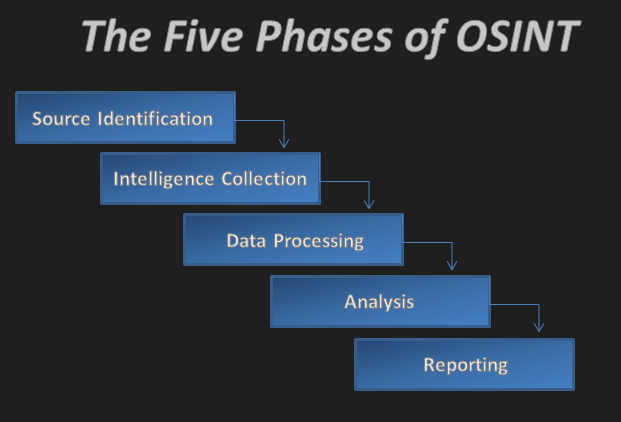

# **OSINT? WTF??**

*What is open-source intelligence?*

> "The internet is just one giant book that is written in real-time, about all of us. 
> -You just have to know how to read it".

​					*Our world is more connected than ever before, and our data is all out there somewhere.*

So anon, while sailing the high seas of the internet, what made you drop your anchors here?

I'd assume you're here because you are a curious individual and want to know more about OSINT.  What OSINT *really* is, what it's for, what type of people use it, and how to successfully utilize it, right?

Okay cool. So WTF is OSINT anyways? It's actually an acronym.  
**O**pen **S**ource **INT**elligence = **OSINT**.

Open-source intelligence as described by its [Wikipedia article](https://en.wikipedia.org/wiki/Open-source_intelligence) ([WikiLess](https://wikiless.org/wiki/Open-source_intelligence)):

> **Open-source intelligence** (**OSINT**) is a multi-factor (qualitative, quantitative) methodology for collecting, analyzing and making decisions about data accessible in publicly available sources to be used in an [intelligence](https://en.wikipedia.org/wiki/Intelligence_(information_gathering)) ([WikiLess](https://wikiless.org/wiki/Intelligence_assessment)) context. In the [intelligence community](https://en.wikipedia.org/wiki/Intelligence_agency) ([WikiLess](https://wikiless.org/wiki/Intelligence_agency)), the term "open" refers to [overt](https://en.wiktionary.org/wiki/overt#Adjective), publicly available sources (as opposed to covert or clandestine sources). OSINT under one name or another has been around for hundreds of years. With the advent of instant communications and rapid information transfer, a great deal of actionable and predictive intelligence can now be obtained from public, unclassified sources. It is not related to [open-source software](https://en.wikipedia.org/wiki/Open-source_software) ([WikiLess](https://wikiless.org/wiki/Open-source_software)) or [collective intelligence](https://en.wikipedia.org/wiki/Collective_intelligence) ([WikiLess](https://wikiless.org/wiki/Collective_intelligence)).

Basically, this is the practice of collecting publicly available, open-source information. Further reading material can be found at the bottom of this article.

> *Open-source? WTF does that mean?? Isn't that a warez thing?*

Well, "open-source" in the context of OSINT means locating and collecting information from any publicly available source. Such as published works, publicly available archives, the internet, your local city hall, books, videos, movies, forums, social media, leaked data, hacked data, pictures, newspapers, reports and so on. Not to be confused with FOSS warez (That means **F**ree and **O**pen **S**ource **S**oftware, by the way).

These information gathering techniques have been used for over 2,000 years. Back in the day, this was used in written form. Art, sculptures, books, scrolls, cave paintings, carvings, and so on. In the more modern centuries, libraries, archives, newspapers, documents and images were used. After technology advanced a bit, recorded telegraphs, radio frequencies, television broadcasts, government archives, city hall archives, and things of that nature were also used. Developed in the late 20th century, humanity was gifted the [world wide web](https://en.wikipedia.org/wiki/World_Wide_Web) ([WikiLess](https://wikiless.org/wiki/World_Wide_Web?lang=en)), also known as the *internet*. 
With the creation of search engines, online phone books, online newspapers, BBS boards, IRC channels, social media sites, searchable archives, the BitTorrent protocol, file sharing sites, decentralized networks, scene/warez groups, and all the other millions of different things available online, everything in the intelligence game changed permanently for everyone.

These OSINT operations, which are conducted by governments, private sector agencies, police and other law enforcement entities, journalists, investigators, [private military contractors (PMCs)](https://en.wikipedia.org/wiki/Private_military_company) ([WikiLess](https://wikiless.org/wiki/Private_military_company?lang=en)), state-sanctioned [advanced persistent threats (APTs)](https://en.wikipedia.org/wiki/Advanced_persistent_threat) ([WikiLess](https://wikiless.org/wiki/Advanced_persistent_threat?lang=en)), cyber-security specialists, whitehats, blackhats, script kiddies on Xbox Live and your average everyday low-tech users alike. For example, have you ever Googled yourself? Looked up someone that you know online? Searched for someone or something that you wanted to know more about? Did you find anything? I bet you probably did.

Gratz! You have already technically conducted an extremely basic OSINT investigation. Your trophy is in the mail!

> *So, you're just a "professional Googler"?*

Technically *no*, but also *yes*.

Open-source information gathering gets way more complex than just simply looking things up on Google. Although using search engines is usually a good place to start your initial investigation.

> *Yeah right. I searched someone on Google and found loads of info on the first page.. Get good skid.*

Great, your target has a large online presence, therefor makes your job much easier. OSINT in general is a massive subject that is constantly evolving and new techniques are always being explored and new tricks being discovered. This is a huge subject, and here's why.

First of all, the term "***OSINT***" is essentially an "*umbrella*" term for open-source intelligence work. There are many different categories in the intelligence field plus a ton of different acronyms are used for different topics of research, which are explained below.

Here is a list and brief descriptions of the common acronyms that you will likely come across on your investigative journey into the exciting realm of open-source intelligence.

| Acronym     | Meaning                                                     |
| ----------- | ----------------------------------------------------------- |
| **OSINT**   | **O**pen-**S**ource **Int**elligence                        |
| **SOCMINT** | **Soc**ial **M**edia **Int**elligence                       |
| **GEOINT**  | **Geo**spatial **Int**elligence                            |
| **IMINT**   | **Im**agery **Int**elligence                                |
| **ORBINT**  | **Orb**ital **Int**elligence                                |
| **VATINT**  | **V**ehicle **a**nd **T**ransportation **Int**elligence     |
| **SIGINT**  | **Sig**nals **Int**elligence                                |
| **TECHINT** | **Tech**nical **Int**elligence                              |
| **FININT**  | **Fin**ancial **Int**elligence                              |
| **AML**     | **A**nti **M**oney **L**aundering                           |
| **TRADINT** | **Trad**e **Int**elligence                                  |
| **CORPINT** | **Corp**orate **Int**elligence                              |
| **HUMINT**  | **Hum**an **Int**elligence                                  |
| **SE**      | **S**ocial **E**ngineering                                  |
| **MASINT**  | **M**easurement **a**nd **S**ignature **Int**elligence      |
| **DNINT**   | **D**igital **N**etwork **Int**elligence                    |
| **PERSINT** | **Pers**onality **Int**elligence                            |
| **RUMINT**  | **Rum**or **Int**elligence                                  |
| **OPSEC**   | **Op**eration **Sec**urity                                  |
| **TSCM**    | **T**echnical **S**urveillance **C**ounter-**M**easures     |
| **CI**      | **C**ounter-**I**ntelligence/**C**onfidential **I**nformant |
| **POI**     | **P**erson **o**f **I**nterest                              |

That is most of them. Read some more here.

- [Wikipedia - List of Intelligence Gathering Disciplines](https://en.wikipedia.org/wiki/List_of_intelligence_gathering_disciplines). 
  - ([Wayback](https://web.archive.org/web/20211002002607/https://en.wikipedia.org/wiki/List_of_intelligence_gathering_disciplines)), ([archive.today](https://archive.ph/rfzRf)), ([WikiLess](https://wikiless.org/wiki/List_of_intelligence_gathering_disciplines?lang=en)).
- [[PDF] DIA - Defense and Intelligence Abbreviations and Acronyms - November 1997](https://www.dia.mil/FOIA/FOIA-Electronic-Reading-Room/FOIA-Reading-Room-Other-Available-Records/FileId/39954/). 
  - ([Wayback](https://web.archive.org/web/20210810222713/https://www.dia.mil/FOIA/FOIA-Electronic-Reading-Room/FOIA-Reading-Room-Other-Available-Records/FileId/39954/)), ([Library Genesis](http://libgen.rs/book/index.php?md5=2ABBB54324D2F6403298914E7522D039)).
- [[PDF] Counter Intelligence Glossary - Terms and Definitions of Interest for CI Professionals - June 2014](https://fas.org/irp/eprint/ci-glossary.pdf).
  - ([Wayback](https://web.archive.org/web/20211002003503/https://irp.fas.org/eprint/ci-glossary.pdf)), ([Library Genesis](http://libgen.rs/book/index.php?md5=8567E71ED1658AF9496B5CEB780CFB1B)).

Did you read those? Probably not, but that's okay. Just save them to your drive for future reference at least.

> k cool..  So what is any of this crap good for anyways? Can I find out what my 9th grade girlfriend is up to now?

It's good for discovering information on just about anything. So yes, you *could* be a weirdo and creep your ex from the 9th grade if that's what you really want to do... However, doing that is certainly not recommended, extremely stalker-ish and certainly not what this blog is all about. 

No wonder she dumped you lmao.

​							A typical OSINT professionals apartment, in case you were wondering.

## **The Two OSINT Approaches**

There are generally considered to be two different ways how information can be collected using OSINT. 

***Passive*** collection and ***Offensive*** collection.

**Approach: Passive Collection**  
Passive OSINT is the preferred way to collect information, this means you are not in any way interacting with your target(s) at all. Not messaging the target, not sending friend requests, not liking posts, not following their accounts, and so on. Instead, you are collecting information without ever making the target aware of it. An investigator would remain distant from the target, therefor having a much lower risk of getting burned. Here are some examples of what a passive approach would include.

- Searching a target's username online to locate other accounts.
- Looking up a target's email addresses in data breaches and leaks.
- Saving posts, images and videos from a target social media accounts (Assuming they are public accounts).
- Looking up historical WHOIS and DNS records for a target domain.

**Approach: Offensive Collection**  
Offensive OSINT (Also known as "*Active OSINT*") is not usually recommended, as it brings heat towards you because you are making contact with the target in some way. You may risk spooking your target into hiding or having them start removing their online presence. However, sometimes it may be necessary for an investigator to interact with their target in some way, just be sure if you are going to do this. You do it properly by using sock-puppet accounts, VPNs, disposable VMs, etc. Here are some examples of what an offensive approach would include.

- Sending your target a friend request or follow request from a sock-puppet account.
- Sending your target a private message of any kind.
- Liking, commenting or sharing a target's posts.
- Scanning a target web site or device.

## **The OSINT Process**

There are usually considered to be five phases for conducting a successful OSINT investigation. Take a look at this flow chart for a quick understanding of what the hell I'm talking about.

​									A basic diagram that shows the five phases of OSINT.

Some professionals have more than 5 phases if a certain investigation requires it. Such as conducting active surveillance and reconnaissance on a physical target or area.

Here is a list of the five phases along with brief descriptions of what they are.

| Phase                       | Description                                                  |
| --------------------------- | ------------------------------------------------------------ |
| **Source Identification**   | Identify and locate potential information sources.           |
| **Intelligence Collection** | Harvesting information from located and newly discovered sources. |
| **Data Processing**         | Process discovered information into a readable, organized and actionable case file. |
| **Analysis**                | Analyze discovered information to uncover patterns and new potential leads. |
| **Reporting**               | Prepare your discoveries for presentation and present it to your superiors, clients or lawyers. |

Here are some additional white-papers about the OSINT processes and various OSINT cycles. Certainly worth reading.

- [[PDF] Open-Source Intelligence Educational Resources - A Visual Perspective Analysis - Applied Sciences - 2020](https://res.mdpi.com/d_attachment/applsci/applsci-10-07617/article_deploy/applsci-10-07617.pdf).
  - ([Wayback](https://web.archive.org/web/20201123114434/https://res.mdpi.com/d_attachment/applsci/applsci-10-07617/article_deploy/applsci-10-07617.pdf)), ([Library Genesis](https://libgen.rs/scimag/10.3390/app10217617)).
- [[PDF] The RIS Open Source Intelligence Cycle - Arno Reuser - 2017](https://arnoreuser.com/wp-content/uploads/2018/12/201712-The-RIS-OSINT-Intelligence-Cycle.pdf).
  - ([Wayback](https://web.archive.org/web/20210802191100/https://arnoreuser.com/wp-content/uploads/2018/12/201712-The-RIS-OSINT-Intelligence-Cycle.pdf)), ([Library Genesis](http://libgen.rs/book/index.php?md5=0AEDA83ECA0BC5DB53ADBD6943B8CEAB)).

## **Additional Reading Material**

This is a list of open-source related books, manuals, articles and research papers that you should read, or at the very least download and/or purchase for future reference.

- [OSINT Techniques: Resources for Uncovering Online Information 10th Edition - Michael Bazzell - 2023](https://inteltechniques.com/book1.html).
  - If you are only going to read one book here, then it should be this one^.
  - ([archive.today](https://archive.ph/nU1Os)).
- [[PDF] US Army - Open-Source Intelligence ATP 2-22.9 - June 2017 - Redacted Copy](https://irp.fas.org/doddir/army/atp2-22-9-2017.pdf).
  - ([Wayback](https://web.archive.org/web/20210926093547/https://irp.fas.org/doddir/army/atp2-22-9-2017.pdf)), ([Library Genesis](https://libgen.rs/book/index.php?md5=B294FA28A8F5E1C52CB7DFE3B391A83C)).
- [[PDF] US Army - Open-Source Intelligence - ATP 2-22.9 - July 2012](https://fas.org/irp/doddir/army/atp2-22-9.pdf).
  - ([Wayback](https://web.archive.org/web/20210926093517/https://irp.fas.org/doddir/army/atp2-22-9.pdf)), ([Library Genesis](https://libgen.rs/book/index.php?md5=090D419ADE50C0E268587291E5F35EC6)).
- [[PDF] Joint Military Intelligence Training Center - Open Source Intelligence Professional Handbook - October 1996](http://www.oss.net/dynamaster/file_archive/080807/a3127ddeaa9a083affdddce6766401fc/Open%20Source%20Intelligence_Professional%20Handbook.pdf).
  - ([Wayback](https://web.archive.org/web/20211011044535/http://www.oss.net/dynamaster/file_archive/080807/a3127ddeaa9a083affdddce6766401fc/Open%20Source%20Intelligence_Professional%20Handbook.pdf)), ([Library Genesis](https://libgen.rs/book/index.php?md5=0EFC24973A3CBE8ED28AE01327772AC5)).
- [[PDF] US Department of Justice - Legal Considerations when Gathering Online Cyber Threat Intelligence and Purchasing Data from Illicit Sources - 2020](https://www.justice.gov/criminal-ccips/page/file/1252341/download).
  - ([Wayback](https://web.archive.org/web/20210808074010/https://www.justice.gov/criminal-ccips/page/file/1252341/download)), ([Library Genesis](https://libgen.rs/book/index.php?md5=D9ED377FB72DFCA4E05403E6BE474D44)).
- [[PDF] The Psychology of Intelligence Analysis - Heuer, R. - 2006](https://www.ialeia.org/docs/Psychology_of_Intelligence_Analysis.pdf).
  - ([Wayback](https://web.archive.org/web/20211011071927/https://www.ialeia.org/docs/Psychology_of_Intelligence_Analysis.pdf)), ([Library Genesis](https://libgen.rs/book/index.php?md5=8597CA7B3A51B41702D419CBDC003BFA)).
- [[PDF] Romanian Intelligence Service - OSINT Handbook - Undated](http://bib.opensourceintelligence.biz/STORAGE/OSINT%20Handbook.pdf).
  - ([Wayback](https://web.archive.org/web/20210903190205/https://bib.opensourceintelligence.biz/STORAGE/OSINT%20Handbook.pdf)), ([Library Genesis](https://libgen.rs/book/index.php?md5=9F546C7EECCA739702604A279E508F11)).
- [[PDF] UFMCS - Red Team Handbook - April 2012](http://bib.opensourceintelligence.biz/STORAGE/2012.%20Red%20Team%20Handbook.pdf).
  - ([Wayback](https://web.archive.org/web/20210903190122/https://bib.opensourceintelligence.biz/STORAGE/2012.%20Red%20Team%20Handbook.pdf)), ([Library Genesis](https://libgen.rs/book/index.php?md5=D504CAF150062A520CC836B3E9622671)).
- [[PDF] Open Source Intelligence Investigation: From Strategy to Implementation - Akhgar, B. - 2016](http://bib.opensourceintelligence.biz/STORAGE/2016.%20Open%20source%20intelligence%20investigation.pdf).
  - ([Wayback](https://web.archive.org/web/20210903190138/https://bib.opensourceintelligence.biz/STORAGE/2016.%20Open%20source%20intelligence%20investigation.pdf)), ([Library Genesis](https://libgen.rs/book/index.php?md5=3D8FFB51AA1DE1C7A5DB47F521EE3045)).
- [[PDF] Sailing the Sea of OSINT in the Information Age - Mercado, S.C. - 2004](http://bib.opensourceintelligence.biz/STORAGE/2004.%20Sailing%20the%20sea%20of%20OSINT.pdf).
  - ([Wayback](https://web.archive.org/web/20210903190116/https://bib.opensourceintelligence.biz/STORAGE/2004.%20Sailing%20the%20sea%20of%20OSINT.pdf)), ([Library Genesis](http://libgen.rs/book/index.php?md5=D6804C2B7EA96CF36D31B058AC3E06EB)).
- [[PDF] OSS - Special Operations Forces Open Source Intelligence (OSINT) Handbook - 2004](http://bib.opensourceintelligence.biz/STORAGE/2004.%20Special%20operations%20forces%20open%20source%20intellingence%20%28OSINT%29%20handbook.pdf).
  - ([Wayback](https://web.archive.org/web/20210903190144/https://bib.opensourceintelligence.biz/STORAGE/2004.%20Special%20operations%20forces%20open%20source%20intellingence%20%28OSINT%29%20handbook.pdf)), ([Library Genesis](https://libgen.rs/book/index.php?md5=0784CE80298B415752AB8ED8E7ED6778)).
- [[PDF] NATO - Open Source Intelligence Handbook - November 2001](http://www.oss.net/dynamaster/file_archive/030201/ca5fb66734f540fbb4f8f6ef759b258c/NATO%20OSINT%20Handbook%20v1.2%20-%20Jan%202002.pdf).
  - ([Wayback](https://web.archive.org/web/20210126020538/http://www.oss.net/dynamaster/file_archive/030201/ca5fb66734f540fbb4f8f6ef759b258c/NATO%20OSINT%20Handbook%20v1.2%20-%20Jan%202002.pdf)), ([Internet Archive](https://archive.org/details/NATOOSINTHandbookV1.2/)).

You probably don't need to read all of those, but you should! If you actually did download and read all of the above books and are hungry for more. Then check out these two awesome and very well put together lists of open-source intelligence related books and papers.

- [The OSINT Treasure Trove](https://bib.opensourceintelligence.biz).
  - ([Wayback](https://web.archive.org/web/20211010192751/http://bib.opensourceintelligence.biz/)), ([archive.today](https://archive.is/0LNPm)). 
- [Blockint - The OSINT Library](https://www.blockint.nl/the-osint-library/).
  - ([Wayback](https://web.archive.org/web/20211011075724/https://www.blockint.nl/the-osint-library/)), ([archive.today](https://archive.is/tYj8M)).

## **Conclusion**

Anyways, if you have an interest for investigative intelligence work, then this is the blog for you. Go ahead and bookmark this site, I'll wait.

Honing in and improving your OSINT skill set will help you in many different aspects of life. Using some 1337 techniques, which I will be showing you in my future posts. We can easily search through a massive pile of available data to find the details and specifics of an individual, group, place, country, company, network, vehicle, boat, aircraft and basically anything else you can imagine.

A lot of this information is something that most of the low-techs and NPC's don't even realize is publicly available, but is.

*Allow me to show you.*

> *19,724 character in 2,242 words.*
